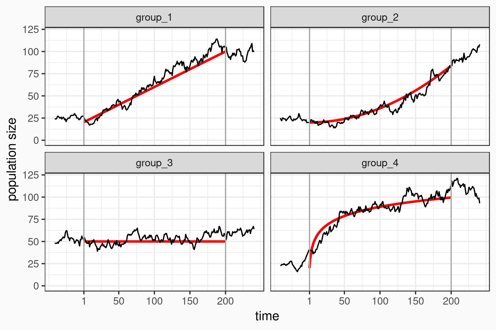
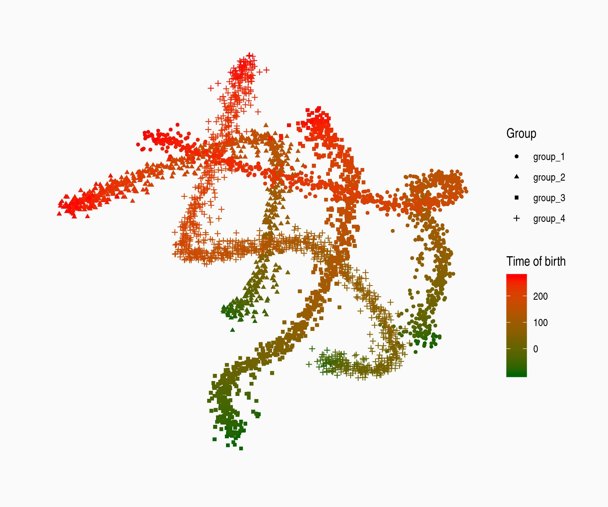
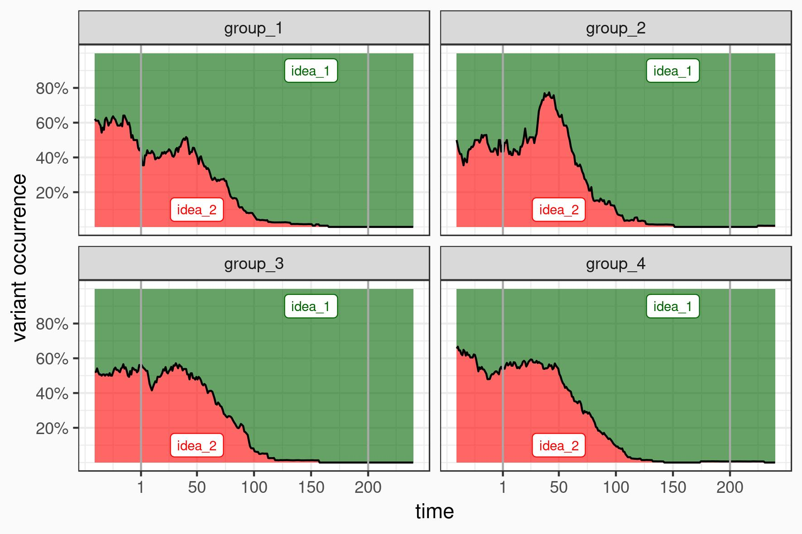

```{r, echo = FALSE}
# https://stackoverflow.com/questions/25646333/code-chunk-font-size-in-rmarkdown-with-knitr-and-latex
def.chunk.hook  <- knitr::knit_hooks$get("chunk")
knitr::knit_hooks$set(chunk = function(x, options) {
  x <- def.chunk.hook(x, options)
  ifelse(options$size != "normalsize", paste0("\\", options$size,"\n\n", x, "\n\n \\normalsize"), x)
})
knitr::opts_chunk$set(echo = TRUE, cache = TRUE)
```

## Cultural Evolution -- Cultural Transmission -- Stylistic Variability

- **Cultural Evolution** theory applies terminology and methods from evolutionary biology to cultural anthropology

- **Cultural Transmission** investigates processes of idea transmission and diffusion of innovation

- Ideas spread in space and time. They exist in **social space** and their spread depends on **social relations**

- The spread of functional and stylistic traits is conceptually different. The fate of stylistic (**selectively neutral**) traits is determined by stochastic processes: **Stylistic Variability**

\usebeamertemplate*{title separator}

- There are many different ways to simulate the spread of **neutral traits**

# Yet another simulation approach: Population Graph based Style Transmission

## Simulation concept: Idea agents in a diachronic population network

**Idea agents**

- Ideas are the **agents**, not humans (*the meme's eye view*)

- Ideas have simple behaviour: **greedy expansion**

- Ideas life in a diachronic **population network**

\usebeamertemplate*{title separator}

**Network world**

- Each **node** represents a **social entity** (**humans**, households, ...)

- Each **edge** represents a **social relationship**

- Social entities **only** have relations to partners in **temporal vicinity**

- Social entities have **stronger** relations to partners in **social vicinity**

## Population generation

- **Populations** are divided into **units** (villages, clans, regions, ...)

- Each **unit** has a `name` and a `size development function` and is made up of **humans**

- Each human has a `year of birth` and a `year of death`

\usebeamertemplate*{title separator}

R package **popgenerator**: https://github.com/nevrome/popgenerator

```{r, eval=FALSE}
popgenerator::init_population_settings() %>% 
  popgenerator::generate_population()
```
  
## Population generation: Code sample I

```{r, eval=FALSE}
time <- 1:200

unit_names <- factor(c("group_1", "group_2", "group_3", "group_4"))

unit_size_functions <- list(
  "group_1" = function(t) {20 + 0.4 * t}, 
  "group_2" = function(t) {20 + (0.04 * t)^2},
  "group_3" = function(t) {50}, 
  "group_4" = function(t) {20 + 15 * log(t)}
)

popgenerator::init_population_settings(
  time, unit_names, unit_size_functions, 
  age_distribution_function, age_range
) %>% popgenerator::generate_population() -> population
```

## Population generation: Result



## Relations generation

- Each **human** can have multiple **vertical** (Parent-Child) and **horizontal** (Friendship, Teacher-Student, ...) relations

- Relations have a **`weight`**, which will be relevant for the idea transmission

- The amount of **cross-unit relations** depends on a `unit interaction matrix` and `type based interaction probabilities`

\usebeamertemplate*{title separator}

R package **popgenerator**: https://github.com/nevrome/popgenerator

```{r, eval=FALSE}
popgenerator::init_relations_settings() %>% 
  popgenerator::generate_relations()
```

## Relations generation: Code sample II

```{r, eval=FALSE}
amount_friends <- 10

weight_child_of <- 50
weight_friend <- 10

distance_matrix_equal <- matrix(1, 4, 4) %>% `diag<-`(0)
cross_unit_proportion_child_of <- 0.002
cross_unit_proportion_friend <- 0.01

popgenerator::init_relations_settings(
  population, amount_friends, distance_matrix_equal, 
  cross_unit_proportion_child_of, cross_unit_proportion_friend,
  weight_child_of, weight_friend
) %>% popgenerator::generate_relations() -> relations
```

## Relations generation: Result



## Idea expansion

- **Ideas** start at some nodes at `t = 0` and expand **greedily** in **cycles**

- Expansion can only happen **along edges**

- Success of conversion depends on **edge `weight`** and **chance**

- The simulation **ends**, when the ideas stop expanding

\usebeamertemplate*{title separator}

C++ CLI program **gluesless**: https://github.com/nevrome/gluesless  
(missing: gluesless-R interface)

```{bash, eval=FALSE}
gluesless -pi network.paj -ii idea_config.txt -o output.txt
```

## Idea expansion: Code sample III

```{r, eval=FALSE}
system2(
  "../gluesless/build/gluesless", 
  args = c(
    "-pi", graph_file, 
    "-ii", ideas_file, 
    "-o", output_file, "-q"
    )
)
result <- readLines("tmp_data/gluesless_result.txt")

idea_development <- population %>%
  dplyr::mutate(
    idea = ifelse(id %in% result_idea_1, "idea_1", "idea_2"),
    from = birth_time - abs(birth_time - death_time)/2, 
    to = death_time
  ) %>%
  aoristAAR::aorist(
    split_vars = c("unit", "idea")
  )
```

## Idea expansion: Result



# What YOU could do now

## Comparing real world time series with simulation results

- Identify processes of fashion change and idea transmission and try to describe them with quantitative (!) **time series**

- Compare these time series and calculate measures of **cultural distance**

- Compare multiple measures of cultural and **spatial distance** to identify **correlation**

\usebeamertemplate*{title separator}

- Explore **models of idea transmission** to understand the **relation of trait distribution and the structure and behaviour of populations**

## Processes of Cultural Transmission: Bronze Age burial rites

\begin{columns}
  \begin{column}{0.40\textwidth}
    \begin{figure}
      \includegraphics{figures/cultrans_bronzeageburials_map_graves.jpeg}
    \end{figure}
    \vspace{0.5cm}
    \footnotesize{Schmid, Evaluating Cultural Transmission in Bronze Age burial rites of Central, Northern and North-western Europe using radiocarbon data, Adaptive Behavior, \textit{forthcoming}}
  \end{column}
  \begin{column}{0.26\textwidth}
    \begin{figure}
      \includegraphics{figures/cultrans_bronzeageburials_development_burial_type.jpeg}
    \end{figure}
  \end{column}
\end{columns}

##

\titlepage
